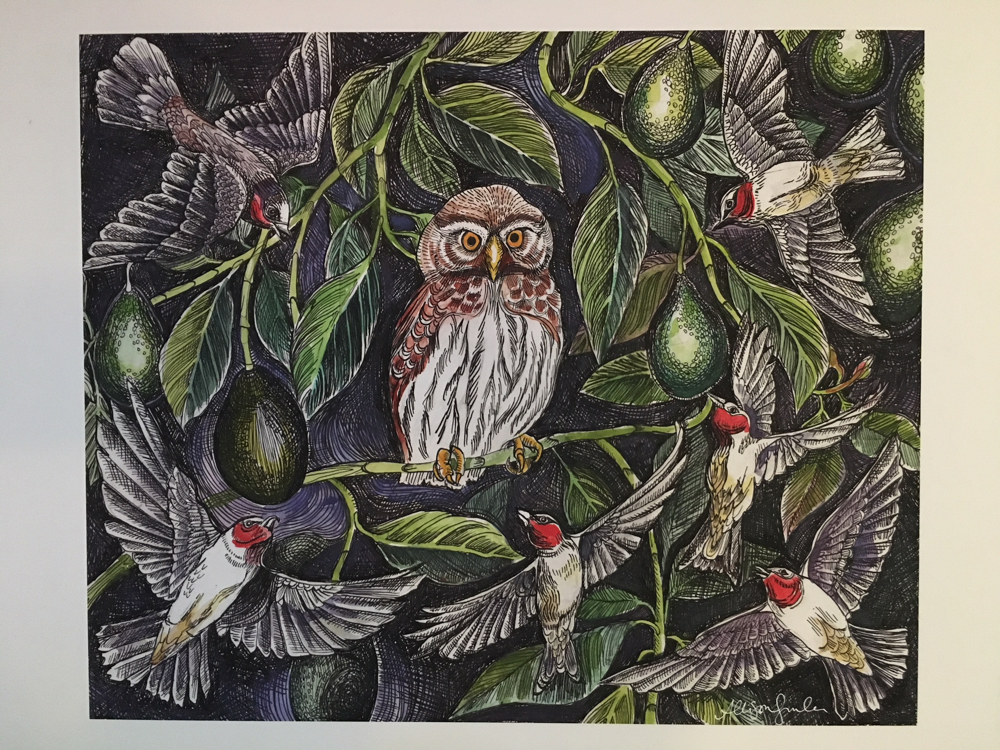

 

##Bay Area Conservation Symposium Art Contest

***

####UC Davis Ecology students have a tradition of hosting art competitions at a variety of student-run events, and we are excited to bring the tradition to this years Symposium! What sort of art can I submit you might ask? Any sort! We have split the competition into two categories, "Photos" and "Other Mediums." In the past, students have submited wildlife photos, pottery, pen drawings, and painted canvases--we welcome all forms of art. 

Please see below for examples from past years, and feel free to email our art coordinator, Lea Pollack, at ljpollack@ucdavis.edu. 

Awards of 25$ will be given to the best pieces from each category. 

***
##Examples of past UC Davis Ecology graduate student art submissions: 

***

 

###*Pen Drawing by Allison Simler*

***

 

###*Pen and Watercolor by Ken Zillig*

***

 

###*Photos by Michael Culshaw-Maurer*

***

 

###*Sculpture by Rob Blenk*
