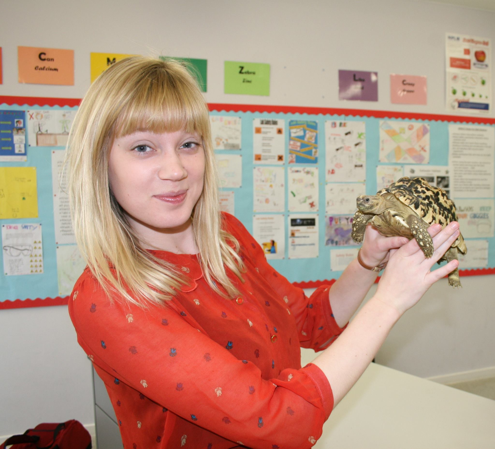
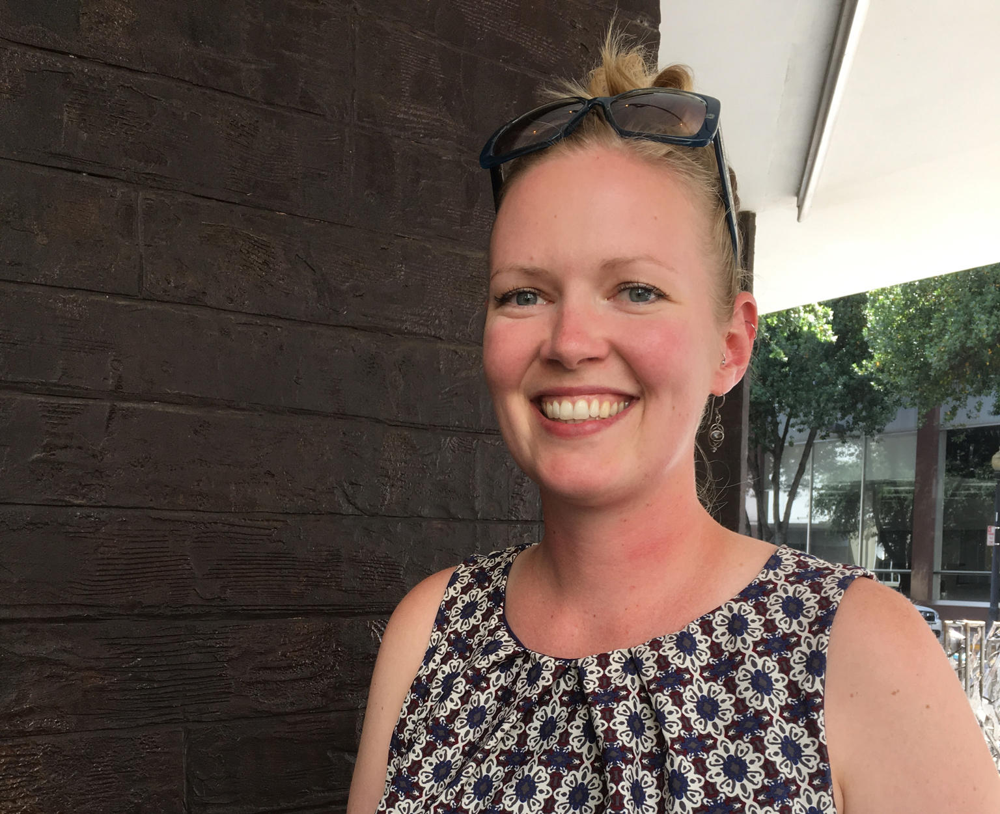

 

##**For questions, please contact scbdavis@gmail.com**

###[**Offical SCB Davis Website**](http://davisscb.wixsite.com/scbdavis)

***

##**Meet our Conference team!**

>**Ken Zillig: SCB Davis President**
>Ken is a 3rd year graduate student in the Graduate Group in Ecology.  His research focuses on understanding the thermal tolerances and physiology of Californian salmon and sturgeon species.  He is interested in how these physiological criteria influence fish ecology as well as how conservation and fisheries management strategies can be informed by temperature data. Additionally, he is interested in topics of adaptation vs. acclimation and how these processes are preparing native at-risk fish species to the challenges of climate change and increasing water demand by people.

>**Amy Collins: SCB Davis Vice President**
>Amy is a third year PhD student in the department of Wildlife, Fish and Conservation Biology. She is interested in using remote sensing methods to monitor habitat fragmentation on the island of Pemba, Tanzania. She is also researching the impacts of roads on wildlife connectivity in California. Originally from the UK, Amy’s previous work includes collaborating with WWF and the Zoological Society of London to assess the characteristics of successful species recovery programs.

>**Emilie Graves: SCB Davis Secretary**
>Emilie is a 3rd-year PhD student in the Graduate Group in Ecology studying the effects of agricultural pesticides on grassland birds and the conservation management of the Tricolored Blackbird, with an interest in advocating for science-based policy.

 

>**Ann Holmes: SCB Davis Treasurer**
>Ann is a second year PhD student in Ecology. She studies fish and other aquatic species using genetic tools. Her research centers on conservation and management questions. In the UC Davis Genomic Variation Lab, she is developing a protocol to monitor an endangered fish using trace DNA in the environment (eDNA).

 

>**Andrea Schreier: SCB Davis Faculty Advisor** 
>Andrea Schreier is an Adjunct Assistant Professor in the Department of Animal Science at UC Davis. Her lab uses genetic and genomic tools to answer ecological questions that directly influence the conservation and management of fish and wildlife species. This majority of this research is conducted collaboratively with state, federal, and tribal management agencies and NGOs, providing students and postdocs with opportunities to work directly with conservation practitioners.