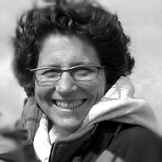

 

###This page will be updated as submissions for posters and talks are recieved. 

***

##**Keynote Speaker: Dr. Ellie Cohen** 

>Ellie Cohen is the President and CEO of Point Blue Conservation Science since 1999, and is a leader in catalyzing collaborative, nature-based solutions to climate change and environmental degradation. 
Born in Baltimore, Ellie received her undergraduate degree with honors in Botany from Duke University. Field studies in butterfly ecology brought her to California in 1979. She later received her Master in Public Policy from Harvard University's Kennedy School of Government, where she was honored with the Policy Analysis Exercise Award for highly distinguished performance and the first annual Robert F. Kennedy Public Service Award. In 2001, she was awarded a fellowship to Stanford Graduate School of Business' Executive Program for Non-profit Leaders.
Ellie is the United Nations Framework Convention on Climate Change (UNFCCC) Observer Organization representative for Point Blue. She is Immediate Past Chair and a Steering Committee member of the CA Landscape Conservation Cooperative, invited member of the SF Bay Area's Resilient by Design Research Advisory Committee, and co-founder of the Bay Area Ecosystems Climate Change Consortium. She serves on the advisory board of the Oiled Wildlife Care Network and on the board of the TomKat Ranch Educational Foundation. In the past, she served as Chair of both the Central Valley and SF Bay Joint Ventures.
Honored to be an invited member of the National Wildlife Federation’s (NWF) Climate-Smart Conservation team, Ellie co-authored the climate-smart principles and the communications chapter in the national “Guide to Climate-Smart Conservation, Putting Adaptation Principles into Practice” (2014).
Ellie was honored with the Bay Nature 2012 Environmental Hero Award for her climate change leadership. In 2009, she was named one of "100 Women Taking the Lead to Save Our Planet" in the US (National Women's History Project). We are very excited to have her as our Keynote Speaker! 

***
##**Tentative Schedule**

9:00 - 9:30  Breakfast and Welcome (Breakfast and Coffee provided by Noah's Bagels)

9:30 - 12:00 Session 1 + 2 

12:00 - 1:00 Lunch (Provided by Dos Coyotes Mexican - vegan and veggie options available)

1:00 - 2:00  Keynote Speaker Dr. Ellie Cohen 

2:00 - 3:30  Session 3 + 4

3:30 - 4:00  Break

4:00 - 5:00  Pannel Discussion: Barriers to Conservation 

5:30 - ??    Happy/Social Hour at [Sudwerks Brewery](http://sudwerkbrew.com/) 

