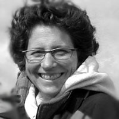

 

##**Keynote Speaker: Dr. Ellie Cohen** 
 

>Ellie Cohen is the President and CEO of Point Blue Conservation Science since 1999, and is a leader in catalyzing collaborative, nature-based solutions to climate change and environmental degradation. 
Born in Baltimore, Ellie received her undergraduate degree with honors in Botany from Duke University. Field studies in butterfly ecology brought her to California in 1979. She later received her Master in Public Policy from Harvard University's Kennedy School of Government, where she was honored with the Policy Analysis Exercise Award for highly distinguished performance and the first annual Robert F. Kennedy Public Service Award. In 2001, she was awarded a fellowship to Stanford Graduate School of Business' Executive Program for Non-profit Leaders.
Ellie is the United Nations Framework Convention on Climate Change (UNFCCC) Observer Organization representative for Point Blue. She is Immediate Past Chair and a Steering Committee member of the CA Landscape Conservation Cooperative, invited member of the SF Bay Area's Resilient by Design Research Advisory Committee, and co-founder of the Bay Area Ecosystems Climate Change Consortium. She serves on the advisory board of the Oiled Wildlife Care Network and on the board of the TomKat Ranch Educational Foundation. In the past, she served as Chair of both the Central Valley and SF Bay Joint Ventures.
Honored to be an invited member of the National Wildlife Federation’s (NWF) Climate-Smart Conservation team, Ellie co-authored the climate-smart principles and the communications chapter in the national “Guide to Climate-Smart Conservation, Putting Adaptation Principles into Practice” (2014).
Ellie was honored with the Bay Nature 2012 Environmental Hero Award for her climate change leadership. In 2009, she was named one of "100 Women Taking the Lead to Save Our Planet" in the US (National Women's History Project). We are very excited to have her as our Keynote Speaker! 

***

##**Panelists for Translational Science Panel**

###**Dr. Hugh Safford**

>Hugh Safford is the Regional Ecologist for the USDA-Forest Service’s Pacific Southwest Region (California, Hawaii, Pacific territories), and also holds a research position in the Department of Environmental Science and Policy at the University of California-Davis. Safford manages a staff of ecologists that provide expertise in vegetation, fire, and restoration ecology, climate change, inventory, and monitoring to land management and planning efforts on the National Forests in the Pacific Southwest Region. His areas of professional expertise are restoration ecology, community ecology, biogeography, and disturbance ecology. Safford is the manager of the Regional Research Natural Area program, the Sierra Nevada region leader for the California Fire Science Delivery Consortium, and a member of the science advisory boards for a number of environmental collaboratives and NGOs. Safford also works internationally, and provides technical assistance on fire, forest management, and climate change issues to the US-Agency for International Development (USAID) and the International Program of the Forest Service. Safford was an editor of Historical Environmental Variation in Conservation and Natural Resource Management, a recently published book exploring the challenges of applying historical reference conditions to the sustainable management of ecosystems in a rapidly changing world. Safford holds a Ph.D. in Ecology from the University of California, an M.A. in Secondary Education from San Francisco State University, and a B.S. in Geology from Montana State University. Safford grew up in southwestern Montana and now splits his time between Davis and Lake Tahoe, California. 

###**Dina Moore**

>Dina partners with her husband Mark to operate the Lone Star Ranch, a commercial cattle ranch and non-industrial timber business in central Humboldt County. Mark and Dina have worked hard at building a sustainable business enterprise that allows for the 6th generation to make a living within the ranching community. They are assisted by their son Jake, daughter Lauren and her husband, Cody.

>Dina has been actively involved in restoration efforts in the Van Duzen watershed, as a founding member of YES (Yager/Van Duzen Environmental Stewards), a ranching landowner-led watershed group. From 2001-2004 she served on the North Coast Regional Water Quality Control Board. She is a graduate of the California Agricultural Leadership Program and was recognized in 2001 by the Agricultural Education Foundation for her leadership in environmental and natural resources stewardship. In 2008, Mark and Dina received the Humboldt Del/Norte Cattleman of the Year award and in 2008 the Buckeye Stewardship award.

>Dina attended UC Davis, has studied environmental dispute resolution at Humboldt State University and most recently is studying up on grandparenting to the 7th generation on the Lone Star Ranch, baby Ora.

###**Rita Mukherjee Hoffstadt**

>Rita Mukherjee Hoffstadt joined Powerhouse Science Center in 2016 as the Deputy Director where she is leading the development and implementation of Powerhouse Science Center's programmatic vision. Prior to joining the Powerhouse Science Center, she was the VP of Education and Visitor Experience at the San Antonio Children’s Museum where she lead the development and implementation of school and public programming, community partnerships, exhibitions, and guest services during a period of rapid expansion. Previous to her role at the San Antonio Children’s Museum, Ms. Hoffstadt was Special Exhibits and Creative Services Director at The Franklin Institute. There she oversaw the museum’s traveling exhibitions and creative services division. She was the lead exhibit developer of the museum’s Changing Earth and Identity exhibitions, oversaw The Franklin Institute’s participation in Communicating Climate Change (C3) NSF, and served as Project Manager and Philadelphia lead for the NSF-funded CCEP-I Urban Climate Education Partnership program. Ms. Hoffstadt has also developed exhibits and program for Thinc Design, The New York Hall of Science, The American Museum of Natural History, The Academy of Natural Sciences, and Columbus Center. Ms. Hoffstadt holds a MS in Education with an emphasis Museum Leadership from Bank Street College and an MS in Biological Sciences from Pennsylvania State University. Ms. Hoffstadt has served on AAM’s National Association for Museum Exhibition (NAME) Board as Program Co Chair, and has acted as the Coordinator of AAM’s Excellence in Exhibition Competition (2009-2011). She was a 2014 Noyce Leadership Fellow in The Noyce Leadership Institute. The fellowship was designed to hone leadership talents of executives in organizations that seek to engage their communities with science. 

